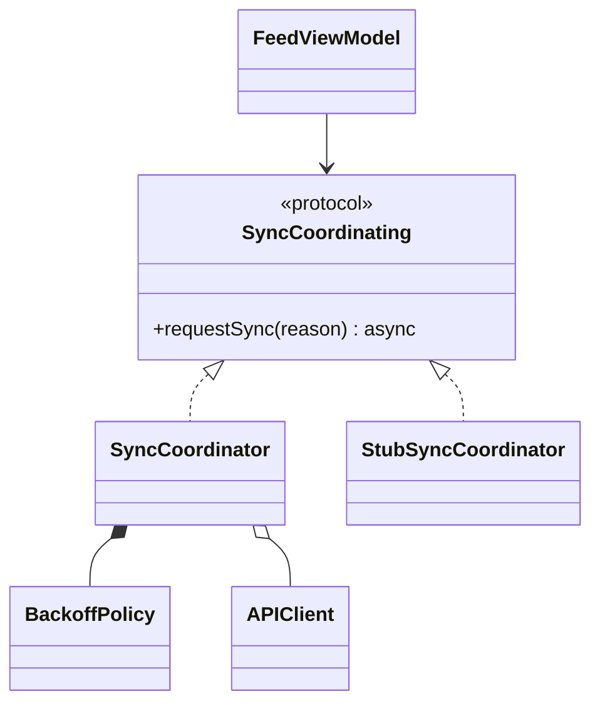
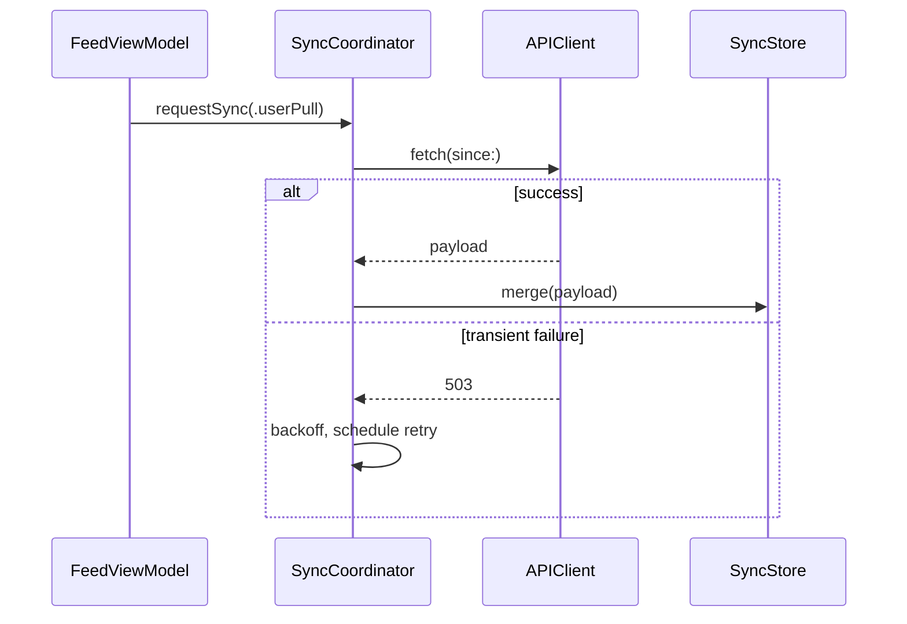
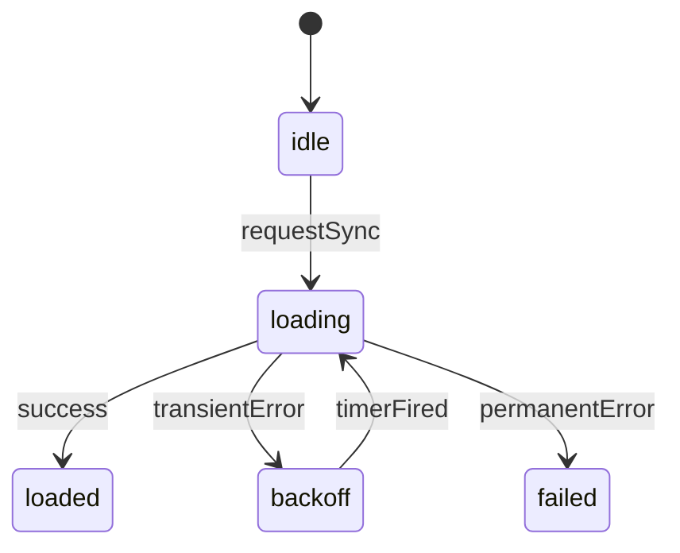

Create or update the implementation plan for the current feature.

Command arguments are optional:

`$ARGUMENTS`

## Resolve The Plan File

- If command arguments name a Markdown file, accept it only when its basename is `plan.md`. Otherwise, ask for a directory or a `plan.md` path.
- If command arguments name a directory, use `<directory>/plan.md`.
- If no argument is provided, use `plan.md` in the current repository or working directory.
- If any non-empty argument does not resolve to an existing directory or a valid `plan.md` path, report it and stop. Do not fall back to the default plan.
- Read an existing target plan before updating it. Preserve its `Review baseline` and `Known gate failures at baseline` values exactly; `/start-work` owns those fields. Write both as the literal word `unset` in a new plan. Never write a placeholder that could be mistaken for a resolved value.
- Require `decision-brief.md` next to the plan. It is the durable source for settled product intent and hard constraints. If missing, stop and tell the user to complete Architect's grilling first. Small work should use the normal `build` agent instead.
- Do not require handoffs, ADRs, tickets, or other planning artifacts.

## Purpose

Grilling settled the approach. Planning settles two things:

1. **Program design** - which components exist, what each one owns, what it must not own, which dependencies are allowed, where state lives, and which interfaces cross a boundary.
2. **Test strategy** - which behavior must hold, at which level it is proven, and by which mode.

Everything else is supporting detail.

## Planning Inputs

- Use `decision-brief.md`, the current Architect conversation, and repository evidence.
- Inspect enough code to make the design realistic and to follow existing conventions.
- Do not invent product or hard-to-reverse architecture decisions. Ask the user when one remains unresolved.
- Do not repeat the product narrative from the decision brief. Repeat only an implementation invariant that is needed to execute or review the design, with a short reference where useful.

## Output Artifact

- Create or update exactly one artifact: the resolved `plan.md`.
- Do not create tickets, behavior files, extra ADRs, or additional planning state.
- Write the plan for a reader who skims. Prefer tables, real code, and diagrams over paragraphs.

Use this shape. Omit any section the feature does not need. The example below carries the maximum of three diagrams because this feature has three genuinely hard questions. Most features need fewer, and many need none.

````md
# Plan: <feature>

Brief: `./decision-brief.md`
Goal: <one line>
Review baseline: unset
Regression gate: `<commands that must stay green>`
Known gate failures at baseline: unset

## Architecture

Tables are normative. Diagrams are explanatory. A dependency that is not listed is forbidden.

| Component | Module / file | Owns | Does not own | May depend on |
|---|---|---|---|---|
| `SyncCoordinator` | `Sync/` (new) | Scheduling, retry policy | Network transport, persistence | `APIClient`, `SyncStore` |
| `SyncStore` | `Sync/` (new) | Local write, conflict resolution | Scheduling | `CoreDataStack` |
| `FeedViewModel` | `Feed/` (modified) | Presentation state | Sync policy | `SyncCoordinating` |

### Interfaces

```swift
// settled: crosses a module boundary
protocol SyncCoordinating: Sendable {
    func requestSync(reason: SyncReason) async
    var state: AsyncStream<SyncState> { get }
}

// provisional: cases may grow during implementation
enum SyncReason { case userPull, appForeground }
```

Fire-and-forget with a state stream because callers must not await network latency.

Apply the Diagram Selection procedure only after the table and interfaces are complete. Do not default to a flowchart. Give each diagram a heading that states its question.

### Types: which implementations share the sync abstraction?



### Flow: where can a retry race a completed fetch?



### State: `SyncCoordinator` - how does a failed sync recover?

Transition owner: `SyncCoordinator`. Other components may send events; only the owner commits a transition or mutates the state.



| From | Event | To | Guard | Effect | Cancels |
|---|---|---|---|---|---|
| `idle` | `requestSync` | `loading` | - | start fetch task | - |
| `loading` | `success` | `loaded` | - | publish payload | - |
| `loading` | `transientError` | `backoff` | attempts < 5 | schedule timer 2^n | fetch task |
| `loading` | `permanentError` | `failed` | - | emit `.failed` | fetch task |
| `backoff` | `timerFired` | `loading` | - | start fetch task | backoff timer |

Illegal, unrepresentable or asserted:

- `idle -> loaded` without a completed fetch.
- Leaving `loading` without cancelling the fetch task.

### Open Seams

| Seam | Option A | Option B | Recommend | Why |
|---|---|---|---|---|
| Conflict resolution | Last write wins | Per-field merge | A | No concurrent editors yet; B stays reversible |

## Test Strategy

| ID | Behavior or invariant | Level | Mode | Proof |
|---|---|---|---|---|
| B1 | A 503 under the attempt cap enters backoff and retries once | unit | test-first | `SyncCoordinatorTests` |
| B2 | Leaving `loading` cancels the in-flight fetch task | unit | test-first | cancellation test |
| B3 | Pull to refresh shows the failure banner | manual | manual | device check |
| B4 | A conflicting local edit resolves to the newer remote timestamp | unit | test-first | `SyncStoreTests` |

```swift
func test_transientFailure_entersBackoffAndRetries() async
func test_leavingLoading_cancelsFetchTask() async
```

## Phases

| # | Phase | Components | Behaviors | Checkpoint |
|---|---|---|---|---|
| 1 | Tracer: stub API, state stream, banner renders | `SyncCoordinator`, `SyncStore`, `FeedViewModel` | B3 | human |
| 2 | Real API and backoff | `SyncCoordinator` | B1, B2 | none |
| 3 | Conflict resolution | `SyncStore` | B4 | none |

## Risks And QA

- Migration risk: none.
- Final QA: full relevant suite plus device pull to refresh before acceptance.
````

## Architecture Rules

- Every component that is new or materially changed gets a row. Do not list untouched components.
- `Owns` is one line. `Does not own` names the responsibility a reader would otherwise expect it to hold.
- `May depend on` is a closed allowlist of the other components, modules, services, and material external packages this component may reach. A collaborator that is not listed is forbidden. Write `none` for an empty cell.
- The allowlist governs component-level collaborators, not language primitives. It does not restrict the standard library, ambient platform frameworks, or the component's own private helpers. List the protocol when a component depends on an abstraction rather than a concrete type.
- Give each interface a status. Use `settled` when a silent Developer change would be wrong, and `provisional` otherwise.
- Write interfaces in the repository's real language, not invented pseudo-code.
- Justify only a non-obvious choice, in at most two sentences, directly under the proposal.
- Use `Open Seams` only where the choice is genuinely open. Do not manufacture alternatives for a settled decision.

## Settled Versus Provisional

Classify by reversal cost and blast radius, not by artifact type.

Usually settled, so a Developer must not change it silently:

- Component responsibility and explicit exclusions.
- Allowed dependency direction.
- State transition authority, effects, and cancellation ownership.
- Contract semantics that cross a module or public boundary.
- Persistence and migration semantics.
- Concurrency isolation, such as actor isolation, main-thread requirements, and sendability.
- Error shape and failure behavior on a crossing-boundary API.
- Module or target placement, because it controls visibility and dependency cycles.

Usually provisional, so a Developer may adapt it and report the adaptation:

- Private helper signatures.
- Exact type and method names.
- File placement inside an already chosen module.
- Test names, fixtures, and internal test structure.
- Local dependency-injection mechanics.

Settled means no silent change. It does not mean immutable. When implementation evidence disproves a settled rule, Architect updates `plan.md` before any later phase depends on the change.

## State Machine Rules

Include a state section only when a component has three or more states, or has effects that must be balanced or cancelled. Otherwise the interface already says enough.

- Name one transition owner per machine. A component may own several orthogonal machines. Other components may send events and observe state; only the owner commits a transition or mutates the state.
- List every legal transition the machine governs. The table is normative, so a transition that appears only in a diagram has no defined effects, cancellations, or coverage obligation.
- Always fill `Effect` and `Cancels`. A transition table without effects is not worth writing.
- List the illegal transitions that matter. Prefer making them unrepresentable in the type system over asserting at runtime.
- Test plausible or externally reachable illegal events. Do not enumerate every impossible pair.

## Diagram Rules

### Selection Procedure

Follow this order. Do not start by drawing a diagram.

1. Finish the normative component table and the interfaces first.
2. List the design questions that remain materially hard to answer by reading them.
3. Match each remaining question to one row of the selection table below.
4. Keep a diagram only when removing it would hide a load-bearing topology, ordering, lifecycle, or cardinality relationship.
5. Use `flowchart` only as a fallback, when no other row fits the question.
6. Emit no diagram when no row qualifies. Zero diagrams is a valid answer, and three is a maximum, never a target.

Give every diagram a heading that states its question, for example `### Flow: Where can cancellation race completion?`. A diagram whose question you cannot write in one line does not belong in the plan.

### Selection Table

| Design question | Diagram | Skip when |
|---|---|---|
| Which types share an abstraction, and what owns what lifetime? | `classDiagram` | The relationship graph has one obvious edge and no lifetime or cardinality question |
| In what order do collaborators interact, and where can that ordering go wrong? | `sequenceDiagram` | The path is straight-line, synchronous, and not behaviorally important |
| What states exist, and how does the machine move between them? | `stateDiagram-v2` | The transition table is short, linear, acyclic, and easy to scan |
| What entities exist, and how do they relate? | `erDiagram` | No entity, relationship, cardinality, ownership, or deletion behavior changes |
| How does data or control branch, route, or transform across components? | `flowchart` | Every edge is already clear from `May depend on`, or there is no branching, routing, transformation, or layer crossing |

Keep a `classDiagram` for several concrete types implementing one abstraction, one type implementing several abstractions, decorator or adapter or composite structure, or load-bearing containment, cardinality, and lifetime ownership. Keep a `sequenceDiagram` for actor or queue hops, reentrant callbacks, delegate ordering, cancellation races, compensation and rollback, or concurrent interleaving. Keep a `stateDiagram-v2` for loops, recovery paths, competing terminal states, or reachability that is hard to trace in the table.

### Diagrams Are Never The Contract

A diagram must not introduce a settled fact that is absent from normative code or tables. Record settled conformance in real type declarations, and record lifetime or ownership requirements in the interface code or a table. A diagram may then visualize those facts when topology, ordering, cycles, fan-out, or cardinality remain materially hard to scan.

Deletion test: if removing the diagram loses no review-relevant visual relationship, remove it.

### Budget

Three diagrams is the maximum. When over budget, cut in this order:

1. Exact duplicates of a table, signature, or another diagram.
2. Diagrams answering the lowest-risk question.
3. Diagrams whose source facts are already easy to scan in normative material.
4. Only then apply the default keep priority: `sequenceDiagram`, `classDiagram`, `stateDiagram-v2`, `erDiagram`, `flowchart`. Keep priority is a tie-breaker, not a ranking of value; lifecycle-heavy or schema-heavy work legitimately inverts it.

### Syntax And Staleness

- Use one `sequenceDiagram` with `alt` to cover the happy path and an important failure path together.
- Keep 3 to 9 nodes. Split or cut a larger diagram.
- Use only `flowchart`, `classDiagram`, `sequenceDiagram`, `stateDiagram-v2`, or `erDiagram`.
- Use plain syntax. Avoid styling directives and exotic features, because a syntax error renders as a broken block.
- In a `classDiagram`, show relationships and at most the one or two members that carry them. A full member listing is a worse duplicate of the interface block.
- UML composition and aggregation mean exclusive part ownership versus an independent lifecycle. They do not mean Swift `strong`, `weak`, or `unowned`. When reference strength is load-bearing, state it in the interface code, not through an arrow.
- Mermaid needs `Repository~Item~` for generics and breaks on punctuation inside names. Simplify or omit the generic parameter.
- Prefer settled names in diagrams. A diagram built from provisional names goes stale without any settled boundary changing.
- When a settled boundary changes, update or delete the affected diagram. Updating or deleting an explanatory diagram is housekeeping, not a program-design change.

## Test Strategy Rules

- Give every row a stable ID such as `B1`. Phases reference these IDs. Never reuse an ID for different behavior.
- State the expected outcome inside the behavior cell, not just the topic.
- `Level` is the cheapest level that can prove the behavior, such as unit, integration, UI, or manual.
- `Mode` is `test-first`, `implementation-first`, `characterization`, or `manual`.
- Prefer `test-first` for pure, local, risky, or easily asserted behavior. Prefer `implementation-first` for exploratory, UI-heavy, integration-heavy, or high-scaffolding work. Use `characterization` when changing existing behavior.
- Require credible fail-before and pass-after evidence for a bug fix and for every `test-first` row when practical. Record why when a pre-change failure cannot be run safely or meaningfully.
- Treat each state transition row as a coverage obligation, not as one test function. A table-driven test may cover many rows, and one guarded row may need several proofs.
- A `Cancels` entry requires a cancellation test that proves no effect runs after cancellation. Add a lifetime or leak test only when object retention is a credible risk.
- Add test skeletons only for load-bearing behavior. Routine skeletons become stale decoration.
- Do not build elaborate test infrastructure only to satisfy the format.

## Phase Rules

- Order phases so the first one produces a runnable end-to-end path, or a focused technical proof that can cheaply disprove a risky assumption.
- Size each phase as the smallest coherent slice that a reviewer can judge in one sitting. Roughly 100 to 200 hand-written changed lines is a useful heuristic, not a limit.
- Reference components by their exact name in the architecture table and behaviors by their exact ID in the test strategy. Every reference must resolve; `/start-work` rejects a plan whose phases name something undefined.
- Set `Checkpoint` to `human` for the first runnable phase and for any phase that crosses a security, persistence, migration, public API, or other hard-to-reverse boundary. Otherwise use `none`.
- Do not assign `developer` or `developer-luna` in the plan. Architect chooses the route immediately before each phase.
- Do not pre-cut phases into ticket files or pre-approved task lists.

## Prose Budget

The budget governs explanatory paragraphs. An explanatory paragraph appears only as justification directly under a proposal, only when the choice is non-obvious, and runs to two sentences maximum.

Required structured content is exempt: header fields, table cells, illegal-transition lists, risk entries, and QA notes. Never restate the product narrative from the decision brief. Do not add a section only to make the plan look complete.

## Plan Review

- Self-review once against the decision brief, repository evidence, the architecture table, and the test strategy.
- Use `oracle` for a focused independent plan review only when security, persistence, migration, public API, broad refactor, or another hard-to-reverse risk justifies it.
- Use `contrarian` only when one uncertain, load-bearing claim needs pressure testing.
- Use Plannotator when useful, but do not require it.
- Incorporate material feedback into `plan.md`. Record a one-line note only when an independent review changed the design.
- Do not create a separate approval or decomposition cycle. The user decides when to begin implementation.

## Final Response

Present the architecture and the test strategy for alignment. Report:

- The plan path, and whether the plan was created or updated.
- The component and ownership table.
- The test strategy table.
- Open seams that still need a decision.
- Material feedback that changed the design.
- The next command: `/start-work` or `/start-work <plan-path>`.
